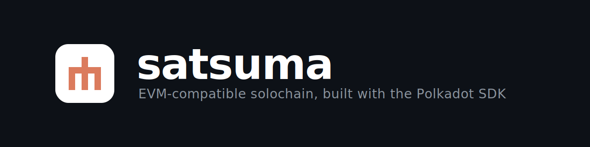

  

<h3 align="center">An EVM-compatible solochain built with the Polkadot SDK.</h3>

  Deploy Solidity contracts with the tooling you already use — MetaMask, Hardhat, Foundry — 
  on a fast, permissioned chain with 2-second blocks and GRANDPA finality.

---

### What we're building

**Satsuma** is a closed, permissioned smart-contract chain. The runtime is intentionally minimal — Aura + GRANDPA consensus, balances, fees, and smart contracts — with no application-specific logic baked in. Everything you build lives in Solidity contracts deployed on top.

- 🟠 **Ethereum-native** — standard JSON-RPC via the `eth-rpc` adapter; your existing wallets and dev tools just work
- ⚡ **Fast & final** — 2-second blocks, deterministic GRANDPA finality
- 🔒 **Permissioned by design** — open reads, whitelisted writes, enforced in the runtime rather than at the network edge
- 🧩 **Built on [Polkadot SDK](https://github.com/paritytech/polkadot-sdk)** — `pallet-revive` for EVM execution on PolkaVM

| | |
|---|---|
| Token | **SUMA** (18 decimals) |
| Chain ID (EIP-155) | `555555555` |
| Consensus | Aura + GRANDPA |
| Block time | 2 seconds |

### Repositories

- **satsuma-node** — the chain: runtime, node, and pallets
- **satsuma** — workspace root

> Most repositories are currently private while the chain is in active development.

Made with 🍊
